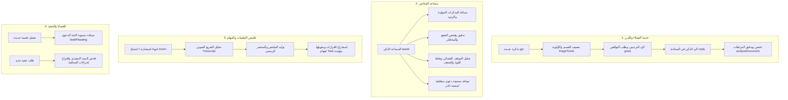
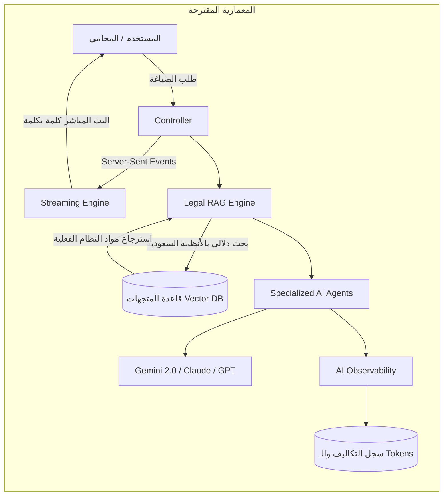

# 🤖 خطة تطوير وهندسة الذكاء الاصطناعي — منصة «سلاسل بابل»
### AI Architecture, Audit & Future Enterprise Roadmap

---

## 📌 الفهرس
1. [ملخص تنفيذي ونظرة عامة](#1-ملخص-تنفيذي-ونظرة-عامة)
2. [الوضع الحالي: مهام ووظائف الذكاء الاصطناعي في المنصة](#2-الوضع-الحالي-مهام-ووظائف-الذكاء-الاصطناعي-في-المنصة)
3. [تحليل المشاكل والقيود الفنية الحالية (Technical Debt & Bottlenecks)](#3-تحليل-المشاكل-والقيود-الفنية-الحالية)
4. [الخطة المعمارية المستقبلية (Enterprise-Grade AI Architecture)](#4-الخطة-المعمارية-المستقبلية)
5. [مراحل التنفيذ وخارطة الطريق (Implementation Roadmap)](#5-مراحل-التنفيذ-وخارطة-الطريق)
6. [نماذج وهياكل برمجية مقترحة (Code Blueprints)](#6-نماذج-وهياكل-برمجية-مقترحة)
7. [قائمة المهام التنفيذية (Actionable Checklist)](#7-قائمة-المهام-التنفيذية)

---

## 1. ملخص تنفيذي ونظرة عامة

يمثل نظام الذكاء الاصطناعي في منصة **«سلاسل بابل»** القلب النابض لأتمتة العمليات القانونية والإدارية، حيث لا يقتصر دوره على المحادثات البسيطة، بل يدير تدفقات العمل الحساسة بدءاً من فرز تذاكر العملاء، فحص المستندات بواسطة الرؤية الحاسوبية (Multimodal)، إعداد الملخصات الرباعية للمستشارين، صياغة اللوائح القانونية المتوافقة مع منصة «ناجز»، وتلخيص تفريغ جلسات Zoom وتحويل قراراتها إلى مهام آلية.

تهدف هذه الوثيقة إلى توثيق الحالة الراهنة بدقة، وتشخيص القيود الفنية، وتقديم **خارطة طريق معمارية متكاملة** لنقل النظام إلى مصاف كبرى المنصات العالمية (Enterprise Grade) عبر إدخال:
- **معمارية الوكلاء المعياريين (Modular Agentic Architecture)**.
- **البث المباشر للردود (Real-Time Streaming / SSE)**.
- **محرك البحث والاسترجاع القانوني المعزز (Saudi Legal RAG System)**.
- **مخرجات JSON الصارمة (Strict Structured Outputs)**.
- **نظام المراقبة وتتبع التكاليف (AI Observability & Cost Tracking)**.

---

## 2. الوضع الحالي: مهام ووظائف الذكاء الاصطناعي في المنصة

يتم تشغيل كافة وظائف الذكاء الاصطناعي عبر خدمة [`LegalAiService`](app/Services/LegalAiService.php) وتدعمها طوابير العمل الخلفية (`Queue Jobs`) وفق 6 محاور رئيسية:



### 1. فرز التذاكر والرد التفاعلي (`Ticket Triage & Chat`)
- **الترحيب وتوجيه العميل (`greet`):** استقبال العميل باسم "خدمة العملاء" وتلخيص طلبه بأسلوب إنساني ودود وطلب المستندات النظامية ذات الصلة بالتخصص المطلوب.
- **تصنيف التذكرة (`triageTicket`):** تحليل مشكلة العميل وتحديد القسم المختص (من بين 14 قسماً قانونياً) وتحديد أولوية الطلب.
- **الردود الذكية في المحادثة (`GenerateTicketReplyJob`):** الرد على استفسارات العميل بأسلوب مهني يستند للأنظمة السعودية دون إصدار أحكام قطعية، مع ميزة ذكية تتمثل في **إيقاف الرد الآلي تلقائياً بمجرد إحالة التذكرة للمحامي البشري**.
- **فحص وتدقيق المرفقات (`TriageDocumentJob`):** قراءة ملفات Word والنصوص، واستخدام Gemini Multimodal لقراءة وتدقيق ملفات **PDF والصور** وتحديد صلة المستند بالدعوى ومحتواه ونوعه.

### 2. الملخص الرباعي للمستشار (`GenerateTicketSummaryJob`)
- إعداد ملخص قانوني شامل من 4 ركائز (ملخص القضية، ملخص المرفقات، الوقائع متسلسلة، النقاط الجوهرية والتكييف المبدئي).
- ميزة **الشفاء الذاتي (Self-Healing)** وإعادة المحاولة حتى 24 ساعة في حال نفاد الحصة أو تعطل المزوّد.

### 3. المساعد التوليدي للمحامي (`Lawyer\AssistantController`)
- **صياغة المذكرات الجوابية واللوائح القضائية:** تشمل الديباجة، صفة الأطراف، الدفوع الشكلية، التفنيد الموضوعي، الأسانيد الشرعية والنظامية، والطلبات الختامية.
- **فحص وتدقيق العقود:** استخراج جدول المخاطر والشروط الباطلة ومطابقتها مع نظام المعاملات المدنية.
- **تحليل الموقف القضائي:** استخراج نقاط القوة والضعف وخطة الترافع.
- **تكييف الدعاوى وتحديد الاختصاص** النوعي والمكاني والولائي.
- **توليد صحيفة دعوى معتمدة لمنصة «ناجز»** التابعة لوزارة العدل.

### 4. تحليل وتلخيص جلسات Zoom والاجتماعات (`DecisionTasks`)
- قراءة وتفريغ محادثات Zoom وتوليد محضر الاجتماع والقرارات، ثم **تحويل القرارات تلقائياً إلى مهام تنفيذية (`Task`)** تسند لموظفي المكتب.

### 5. مسودات القضايا وطلبات التنفيذ
- صياغة مسودة لائحة الدعوى فور سداد العميل لأتعاب القضية (`DraftCasePleadingJob`).
- دراسة السندات التنفيذية والتأكد من بيانات المنفذ ضده واقتراح إجراءات محكمة التنفيذ (حجز، إفصاح، إخطار) (`AnalyzeExecutionJob`).

---

## 3. تحليل المشاكل والقيود الفنية الحالية

| # | المشكلة / القيد الفني | الشرح والأثر التشغيلي |
|---|---|---|
| 1 | **تمركز المنطق في ملف واحد (God Class)** | ملف [`LegalAiService.php`](app/Services/LegalAiService.php) بحجم 86KB و 1330+ سطراً يجمع كل شيء معاً (البرومبتات، الموديلات، الـ OCR، تلخيص Zoom، قاطع الدائرة). يصعب صيانته وتوسيعه واختباره بمعزل عن بقية الأجزاء. |
| 2 | **الاستدعاء المتزامن الطويل للمحامي** | في [`Lawyer\AssistantController::generate`](app/Http/Controllers/Lawyer/AssistantController.php)، ينتظر المحامي التوليد متزامناً برفع المهلة إلى 150 ثانية (`WebTimeLimit::raise(150)`). هذا يستهلك عمال الـ PHP-FPM ويعرض الطلب لمشاكل 504 Gateway Timeout خلف Nginx/Cloudflare. |
| 3 | **غياب البث المباشر (No Streaming)** | المحامي أو الموظف ينتظر شاشة بيضاء أو مؤشر تحميل لمدة 15-25 ثانية حتى تكتمل الصياغة بالكامل، بدلاً من ظهور النص كلمة بكلمة في الوقت الفعلي (Streaming). |
| 4 | **غياب الـ RAG وقاعدة المعرفة القانونية** | الاعتماد كلياً على ذاكرة النموذج العامة فقط، مما يعرض النظام لاحتمال ذكر مواد نظامية غير دقيقة أو ملغاة (Hallucinations) دون التحقق من نص المادة الساري في السعودية. |
| 5 | **قص النصوص والملفات الكبيرة** | قص النصوص النصية عشوائياً عند 20 ألف حرف (`mb_substr($text, 0, 20000)`) دون تقسيم ذكي (Chunking)، وإرسال ملفات الـ PDF الكبيرة محولة إلى Base64 في الـ Payload، مما يضخم حجم الطلب. |
| 6 | **غياب مصفوفة التكاليف والمراقبة (Observability)** | لا يوجد تسجيل لعدد الـ Tokens المستهلكة (Input/Output)، التكلفة المالية لكل تذكرة/محامٍ، أو قياس زمن الاستجابة وجودة المسودات. |

---

## 4. الخطة المعمارية المستقبلية



---

## 5. مراحل التنفيذ وخارطة الطريق

### 🔹 المرحلة الأولى: تفكيك المعمارية إلى وكلاء متخصصين (Modular Agents)
- إعادة هيكلة مجلد `app/Services/LegalAiService.php` إلى حزمة `App\Services\AI`:
  - `Contracts\AiProviderInterface.php`: واجهة موحدة لكل مزودي الذكاء الاصطناعي.
  - `Providers\GeminiProvider.php` و `Providers\GlmProvider.php` و `Providers\OpenAiProvider.php`.
  - `Core\CircuitBreaker.php`: إدارة فترات التهدئة وقواطع الدائرة عند نفاد الحصص.
  - `Agents\TriageAgent.php`: فرز التذاكر والترحيب وتصنيف النواقص.
  - `Agents\DocumentInspectionAgent.php`: فحص الملفات واستخراج النصوص والـ OCR.
  - `Agents\LegalDrafterAgent.php`: صياغة المذكرات، صحف دعاوى ناجز، ومسودات القضايا.
  - `Agents\ConsultMeetingAgent.php`: معالجة تفريغ Zoom واستخراج القرارات والمهام.

### 🔹 المرحلة الثانية: البث المباشر عبر Server-Sent Events (Real-Time Streaming)
- تحويل مسار `POST /lawyer/assistant/generate` إلى مسار يدعم الـ **SSE (Server-Sent Events)** أو WebSockets عبر Reverb.
- تعديل واجهة المساعد القانوني في الواجهة الأمامية [`pages/lawyer/assistant.tsx`](resources/js/pages/lawyer/assistant.tsx) لقراءة الـ Stream تدريجياً، مما يقضي على مشاكل المهلة ويوفر تجربة استخدام فائقة السرعة.

### 🔹 المرحلة الثالثة: بناء محرك البحث القانوني المعزز (Saudi Legal RAG System)
- إعداد قاعدة متجهات (مثل PostgreSQL مع إضافة `pgvector` أو Meilisearch مع Embeddings).
- أرشفة وفهرسة الأنظمة السعودية الحديثة:
  - نظام المعاملات المدنية (م/191).
  - نظام الإثبات (م/43).
  - نظام المرافعات الشرعية ونظام التنفيذ ونظام الشركات ونظام العمل.
- عند قيام المحامي بطلب صياغة مذكرة، يسترجع محرك الـ RAG نصوص المواد المنطبقة تلقائياً ويغذي بها النموذج لضمان دقة الاستشهاد بنسبة 100%.

### 🔹 المرحلة الرابعة: رفع الملفات عبر Google File API ومخرجات JSON الصارمة
- استخدام `Google Files API` لرفع ملفات الـ PDF الكبيرة مرة واحدة والحصول على URI بدلاً من تحويل الملفات إلى نصوص Base64 في كل طلب.
- تفعيل `responseSchema` المدعومة رسمياً في Gemini للحصول على JSON مطابق للهيكل 100% دون الحاجة لتنظيف الـ Regex.

### 🔹 المرحلة الخامسة: نظام المراقبة، تتبع التكاليف، والتقييم (Observability & Feedback)
- إنشاء جدول هجرة `ai_logs` في قاعدة البيانات.
- تسجيل تفاصيل كل عملية: (المستخدم، نوع الوكيل، الموديل، عدد الـ Input/Output Tokens، التكلفة المقدرة بالريال، زمن الاستجابة بالملي ثانية).
- إضافة أزرار تقييم في واجهة المحامي (إعجاب 👍 / عدم إعجاب 👎 / تعديل يدوي) لتسجيل جودة المسودات وتدريب البرومبتات.

---

## 6. نماذج وهياكل برمجية مقترحة

### 1. نموذج هيكل جدول تتبع العمليات والتكاليف (`ai_logs` Migration)
```php
Schema::create('ai_logs', function (Blueprint $table) {
    $table->id();
    $table->foreignId('user_id')->nullable()->constrained()->nullOnDelete();
    $table->string('agent_type'); // Triage, Drafter, Document, Meeting
    $table->string('model'); // gemini-2.0-flash, gpt-4o
    $table->string('reference_type')->nullable(); // Ticket, LegalCase, Consult
    $table->string('reference_id')->nullable();
    $table->integer('input_tokens')->default(0);
    $table->integer('output_tokens')->default(0);
    $table->decimal('cost_sar', 8, 4)->default(0);
    $table->integer('latency_ms')->default(0);
    $table->boolean('success')->default(true);
    $table->text('error_message')->nullable();
    $table->string('feedback')->nullable(); // thumbs_up, thumbs_down
    $table->timestamps();
});
```

### 2. نموذج استجابة البث المباشر للمحامي (SSE Streaming Controller)
```php
namespace App\Http\Controllers\Lawyer;

use App\Services\AI\Agents\LegalDrafterAgent;
use Illuminate\Http\Request;
use Symfony\Component\HttpFoundation\StreamedResponse;

class AssistantStreamController
{
    public function stream(Request $request, LegalDrafterAgent $drafter): StreamedResponse
    {
        $data = $request->validate([
            'kind' => ['required', 'string'],
            'docType' => ['required', 'string'],
            'ref' => ['nullable', 'string'],
            'context' => ['nullable', 'string'],
        ]);

        return response()->stream(function () use ($drafter, $data) {
            $drafter->streamDraft($data, function ($chunk) {
                echo "data: " . json_encode(['text' => $chunk]) . "\n\n";
                ob_flush();
                flush();
            });
            echo "data: [DONE]\n\n";
            ob_flush();
            flush();
        }, 200, [
            'Content-Type' => 'text/event-stream',
            'Cache-Control' => 'no-cache',
            'X-Accel-Buffering' => 'no',
        ]);
    }
}
```

---

## 7. قائمة المهام التنفيذية (Actionable Checklist)

- [ ] **المرحلة 1: البنية المعمارية للوكلاء**
  - [ ] إنشاء الواجهات المشتركة ومجلد `app/Services/AI`.
  - [ ] استخراج `TriageAgent`، `DocumentInspectionAgent`، `LegalDrafterAgent`، و `ConsultMeetingAgent`.
  - [ ] فصل قاطع الدائرة `CircuitBreaker` في فئة مستقلة وتحديث الفحوصات الآلية (`Tests`).
- [ ] **المرحلة 2: واجهة البث المباشر (Streaming)**
  - [ ] إنشاء مسار `StreamedResponse` للمساعد القانوني.
  - [ ] تحديث صفحة `assistant.tsx` في React لدعم قراءة التدفق اللحظي بالنصوص.
- [ ] **المرحلة 3: قاعدة الأنظمة السعودية والـ RAG**
  - [ ] إعداد حزمة `pgvector` أو محرك البحث الدلالي.
  - [ ] تغذية وفهرسة نصوص نظام المعاملات المدنية، الإثبات، والمرافعات.
  - [ ] ربط وكيل الصياغة باسترجاع النصوص النظامية تلقائياً.
- [ ] **المرحلة 4: تحسين استهلاك المستندات والصيغ المنظمة**
  - [ ] تفعيل `Google Files API` لملفات الـ PDF الكبيرة.
  - [ ] تطبيق `responseSchema` الصارمة لكل مخرجات الـ JSON.
- [ ] **المرحلة 5: المراقبة وتتبع التكاليف**
  - [ ] إنشاء جدول `ai_logs` وتسجيل استهلاك الـ Tokens.
  - [ ] إضافة واجهة مراقبة في لوحة الإدارة (`admin/reports`) لعرض تكاليف الذكاء الاصطناعي الشهرية.
